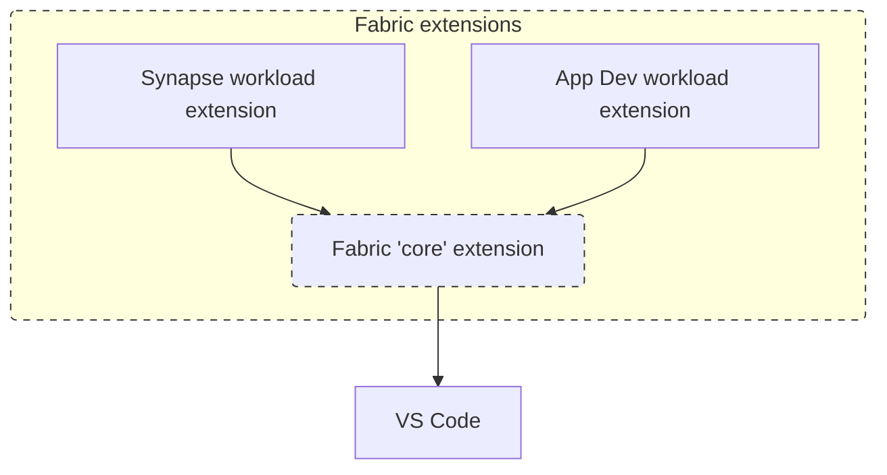

# Architecture Overview
This document gives a high-level view of how the Microsoft Fabric core VS Code extension and optional satellite extensions collaborate. Detailed extensibility guidance and code samples have moved to the [Extensibility Overview](./extensibility-overview.md).

## Overview
The core Fabric extension contributes a workspace view that lets users browse and work with supported Fabric items. It implements generic, item‑agnostic capabilities (authentication, workspace selection, basic CRUD, import/export). Satellite extensions are optional add‑ons that light up richer, item‑specific development experiences. The core exposes an API surface so any number of satellites can contribute UI and behavior.

## Capabilities
The Fabric for VS Code extension provides functionality to enable a user to interact with their Fabric workspace through VS Code. This includes but is not limited to:

 - Logging in to Microsoft Fabric
 - Selecting a Workspace for development
 - View, manage, and develop Microsoft Fabric items from VS Code

## API Collaboration Model
At activation time the core exposes a service collection (account, workspace, artifact). A satellite registers itself (declaring the artifact types it enhances) and selectively provides:

- Tree node providers to extend shared workspace/local project trees
- Artifact handlers to customize lifecycle workflows (create/read/definition/update/delete/etc.)

Extension points are opt‑in; satellites only implement what they need. The core routes user actions through the appropriate satellite pieces when present, falling back to default generic behavior otherwise.

### Architecture Graphic

<!-- Fallback static image (kept in repo intentionally):  -->

## Further Reading
For code samples, workflow hook details, and step‑by‑step registration instructions see the [Extensibility Overview](./extensibility-overview.md). For rules on evolving the API without breaking satellites, see [API Compatibility](./api-compatibility.md). The public TypeScript interfaces live in the `@microsoft/vscode-fabric-api` package – browse the source at: [../api/](../api/).

