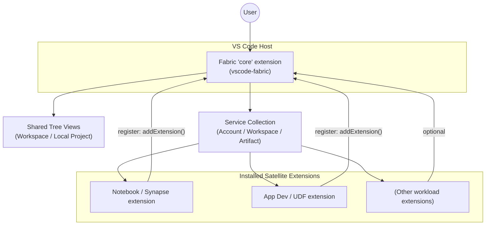

# Extensibility Overview

This document provides the detailed guidance for extending the core Microsoft Fabric VS Code extension. For a concise architectural summary, see the [Architecture Overview](./architecture-overview.md).

## Overview

The “Microsoft Fabric” extension for VS Code provides a core experience for general Fabric functionality in VS Code. This means functionality & features that are NOT specific to a particular item type will be implemented in this extension (i.e., authentication & shared shell components). We refer to this extension as “the core” Fabric extension for VS Code and it is owned by the AppDev team.

The core Fabric extension is designed to be extended by additional item/workload-specific VS Code extensions.  We call these other item/workload-specific extensions Fabric “satellite” extensions. They can be thought of as plugins to the core that expand the functionality of the Microsoft Fabric experience in VS Code and are typically owned by the relevant item/workload team.

Below figure demonstrates the architecture with two satellite extensions. In this example, the Synapse extension adds specific functionality for developing Notebooks, and the App Dev workload adds specific functionality for developing User Data Functions.



## Installation

To begin with Microsoft Fabric in VS Code, a user only needs to install the core extension. This enables them to authenticate, browse their remote Fabric Workspace, perform basic CRUD of all item types, and perform simple export & import of item definitions.

In cases where the core is aware of item-specific features available via a satellite, it may suggest installing that satellite to add functionality. For example, this is evident in the remote Fabric Workspace tree view:

If a user installs a satellite extension first, the core extension will be automatically included by way of VS Marketplace extension dependencies.

Furthermore, a Microsoft Fabric extension “pack” will be available on the VS Marketplace as a mechanism to install all Fabric related extensions at once.

Satellite extensions typically declare the core as an explicit dependency in their `package.json` so VS Code installs/activates the core first. This is recommended but optional. If you omit it, your extension MUST gracefully handle the core not being installed or activated (e.g., detect absence, prompt user to install, or defer feature enablement until available).

Recommended snippet:

```json
"extensionDependencies": [
  "fabric.vscode-fabric"
]
```

## Extending the Microsoft Fabric extension

Satellite extensions have two primary ways of extending the core experience. They are:

- Extending the shared tree views – for example, the child nodes that are specific to an item type can be added to the remote Fabric Workspace tree.

- Customizing item-generic actions with item-specific behavior – for example, while the core will allow for generic item export (via the Get Item Definition API), a satellite may want to customize that experience for a specific item (i.e., a Notebook export may download additional resources not include in export).

When a satellite extension is activated, it must acquire the core's extension manager and register itself, providing its node providers (#1 above) and any custom artifact handlers (#2 above).

Minimal retrieval example:

```ts
import * as vscode from 'vscode';
import * as fabric from '@microsoft/vscode-fabric-api';

export async function activate(ctx: vscode.ExtensionContext) {
  const core = vscode.extensions.getExtension('fabric.vscode-fabric')?.exports as fabric.IFabricExtensionManager;
  if (!core) { throw new Error('Core Fabric extension not available'); }
  const ext: fabric.IFabricExtension = {
    identity: ctx.extension.id,
    apiVersion: fabric.apiVersion, // must match major.minor
    artifactTypes: ['Notebook'],
    treeNodeProviders: [],
    localProjectTreeNodeProviders: [],
    artifactHandlers: []
  };
  const services = core.addExtension(ext); // IFabricExtensionServiceCollection
  // services.accountManager / services.workspaceManager / services.artifactManager now available
}
```

### Extending the tree views (node providers)

To add item-specific nodes to the Microsoft Fabric tree views, the satellite extension must implement the necessary interfaces and register them with the core (during activate). Currently there are two tree views that can be extended:

- The Fabric Workspace tree view via IFabricTreeNodeProvider

- The Local Folder tree view via ILocalProjectTreeNodeProvider

For example:

```ts
// Satellite extension activation (simplified)
export function activate(ctx: vscode.ExtensionContext, core: IFabricExtensionManager) {
 const ext: IFabricExtension = {
  identity: 'fabric.example-satellite',
  apiVersion,                       // must match major.minor of core
  artifactTypes: ['Notebook'],      // declare types you contribute to
  treeNodeProviders: [new NotebookTreeNodeProvider(ctx)],
  localProjectTreeNodeProviders: [new NotebookLocalProjectProvider(ctx)],
 };
 const services = core.addExtension(ext); // returns IFabricExtensionServiceCollection
 // services.workspaceManager / services.artifactManager now available
}

// Remote workspace tree customization
class NotebookTreeNodeProvider implements IFabricTreeNodeProvider {
 public readonly artifactType = 'Notebook';
 constructor(private ctx: vscode.ExtensionContext) {}

 async createArtifactTreeNode(artifact: IArtifact): Promise<ArtifactTreeNode> {
  // Return your specialized node (can override getChildNodes, commands, contextValue, etc.)
  return new NotebookTreeNode(this.ctx, artifact);
 }
}

// Local project tree customization
class NotebookLocalProjectProvider implements ILocalProjectTreeNodeProvider {
 public readonly artifactType = 'Notebook';
 constructor(private ctx: vscode.ExtensionContext) {}

 async createLocalProjectTreeNode(folder: Uri): Promise<LocalProjectTreeNode | undefined> {
  // Validate folder layout (e.g., contains *.ipynb)
  const hasIpynb = await containsIpynb(folder);
  if (!hasIpynb) { return undefined; } // not a Notebook project
  // Display name derived from folder name (core default logic may already do this)
  return new LocalProjectTreeNode(this.ctx, path.basename(folder.fsPath), folder);
 }
}
```

By providing the node provider implementation, the satellite extension assumes full control of the tree node and its children.

### Overriding core behaviors (artifact handlers)

Artifact handlers let a satellite customize one or more lifecycle actions for a given artifact type (create, read, get/update definition, delete, rename, etc.). A handler advertises a single `artifactType` and then selectively implements workflow objects. Each workflow exposes `onBefore*` and/or `onAfter*` hooks that the core calls inside the `ArtifactManager` right before issuing the Fabric REST request and after receiving the response. You only implement the hooks you need; everything else falls back to the core default behavior.

Common workflows (implement only those you need):

- `createWorkflow` – Gather additional creation metadata UI, modify the outgoing request, respond to success.
- `readWorkflow` – Adjust request before reading an artifact (e.g., query params).
- `getDefinitionWorkflow` – Customize how definitions are retrieved or perform post‑processing (e.g., enforce format, add local files).
- `updateDefinitionWorkflow` – Validate or transform the definition before upload; adjust post‑update side effects.
- `createWithDefinitionWorkflow` – Same as create + definition in one step (e.g., Report bound to Semantic Model).
- `deleteWorkflow` – Pre‑delete confirmation logic or audit tagging.
- `renameWorkflow` – Validate new name, enforce conventions.

Legacy hooks (`onBeforeRequest`, `onAfterRequest`, `onOpen`) are deprecated in favor of the workflow model; avoid adding new usages.

Execution order (simplified) for a definition update:

1. Core resolves the correct `IArtifactHandler` via `artifactType`.
2. If `updateDefinitionWorkflow.onBeforeUpdateDefinition` exists it can mutate `IApiClientRequestOptions` and/or the definition object.
3. Core performs REST call.
4. If present, `onAfterUpdateDefinition` runs for post‑processing.

Pseudo code example:

```ts
class NotebookArtifactHandler implements IArtifactHandler {
 readonly artifactType = 'Notebook';

 // Enforce ipynb download & validate local format before GET definition
 getDefinitionWorkflow = {
  async onBeforeGetDefinition(artifact, folder, options) {
   const format = await detectLocalNotebookFormat(folder); // 'ipynb' | 'py' | 'mixed' | 'unknown'
   if (format === 'mixed') { throw new Error('Mixed .py and .ipynb not supported'); }
   if (format !== 'py') { options.pathTemplate = appendQuery(options.pathTemplate, 'format=ipynb'); }
   return options;
  }
 };

 // Normalize definition before update (e.g., ensure explicit ipynb format marker)
 updateDefinitionWorkflow = {
  async onBeforeUpdateDefinition(_artifact, definition, _folder, options) {
   if (containsIpynbOnly(definition)) {
    definition.format = 'ipynb';
    // ensure body carries mutated object if wrapper present
    if (options.body?.definition) { options.body.definition = definition; }
   }
   return options;
  }
 };
}

// Another example: Report handler binding to a Semantic Model at create/update with definition
class ReportArtifactHandler implements IArtifactHandler {
 readonly artifactType = 'Report';

 private async ensureSemanticModelBinding(definition) {
  if (alreadyBound(definition)) { return; }
  const semanticModel = await promptForSemanticModel();
  rewriteDefinitionPbir(definition, semanticModel.id);
 }

 updateDefinitionWorkflow = {
  onBeforeUpdateDefinition: async (artifact, definition, folder, options) => {
   await this.ensureSemanticModelBinding(definition);
   return options;
  }
 };

 createWithDefinitionWorkflow = {
  onBeforeCreateWithDefinition: async (artifact, definition, folder, options) => {
   await this.ensureSemanticModelBinding(definition);
   return options;
  }
 };
}
```

## Leveraging the Microsoft Fabric extension

The core extension provides some services & libraries that are useful for satellites to leverage for consistent behavior.

### Service collection

When the satellite extension registers itself with the core, an IFabricExtensionServiceCollection is returned. This contains three primary services:

- Account Manager – this service provides the user authentication context and can be used to ensure the is signed in and acquire a user token.

- Workspace Manager – this service provides information about the user’s workspace, such as local folder mapping.
- Artifact Manager – orchestrates artifact lifecycle operations (read, create, delete, rename, open, get/update/create-with definition). It resolves the correct `IArtifactHandler` for a given `artifactType`, invokes any workflow hooks (`onBefore*` / REST call / `onAfter*`), manages local file materialization (definitions to disk), and centralizes error & telemetry patterns so satellites only focus on item-specific logic.

### Shared library

The core team provides a @fabric/vscode-fabric-util NPM package with implementations of various classes where consistency across core & satellites might be useful.  This is entirely optional for the satellites to consume. Examples include:

- Configuration & Environment
  - `ConfigurationProvider` – typed access to `Fabric.*` user/workspace settings with change events per key
  - `FabricEnvironmentProvider` / `FabricEnvironment` – resolves current environment metadata (clientId, scopes, portal/api URIs) and emits change events
- Telemetry & Logging
  - `TelemetryService` – supports multiple extension instances; satellites get dynamic core default properties via a supplied function
  - `TelemetryActivity` helpers – duration + success/failure aggregation
  - `Logger` & `MockConsoleLogger` – VS Code native log level integration with trace/debug/info/warn/error methods. See [Logger Utility Guide](./util/logger.md) for usage patterns and migration from deprecated methods
- Error & UX helpers
  - `FabricError`, `doFabricAction`, `withErrorHandling` – consistent error surfacing, localization vs. aggregable messages, telemetry enrichment
  - `UserCancelledError` – signal user intent without fault telemetry
- Execution & Task utilities
  - `doTaskWithTimeout`, `TaskHelperWithTimeout` – wrap promises with timeout semantics
  - `sleep`, `doExecuteTerminalTask` – simple async & terminal execution helpers
- Content & File helpers
  - `zipUtilities` (encode/decode, message reporting), `MemoryFileSystem` – in‑memory FS for tests or virtual operations
  - `FabricUriHandler` – creates/handles internal Fabric scheme URIs (e.g., virtual documents)
- Misc / Test Support
  - `VSCodeUIBypass` & `testSupport` – deterministic UI/test flows
  - `DisposableCollection` – simplify disposable lifetime management
  - `FabricUtilities.doJSONParse` – JSON parse with logged telemetry on failure
  - `CoreServiceCollectionProvider` – wiring helper for constructing shared service sets

Satellite extensions should favor these helpers to reduce duplicated infrastructure (telemetry wiring, logging, error processing) and keep focus on artifact‑specific logic; adoption is optional and incremental.
